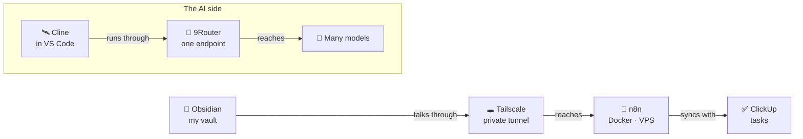

### Stack

The tools I use to build, publish and keep my garden growing.

### 🤖 Coding agents

| Tool | How I use it |
|---|---|
| 🤖 **[Claude Code](https://claude.com/claude-code?utm_source=haphan.digital&utm_medium=referral&utm_campaign=stack&utm_content=claude-code)** | The strategist: it thinks about the big picture and plans the next move while I nod wisely. |
| 🛰️ **[Cline](https://cline.bot/?utm_source=haphan.digital&utm_medium=referral&utm_campaign=stack&utm_content=cline)** | The muscle-bound builder inside VS Code: hunts through folders, edits files and tidies up the mess while I supervise. |

### 🚦 AI routing

| Tool | How I use it |
|---|---|
| 🧭 **[9Router](https://github.com/decolua/9router?utm_source=haphan.digital&utm_medium=referral&utm_campaign=stack&utm_content=9router)** | One endpoint that keeps Cline running on many models, completely free, so I get more done without watching the meter. |

### 🧩 Languages & frameworks

| Tool | How I use it |
|---|---|
| 🚀 **[Astro](https://astro.build/?utm_source=haphan.digital&utm_medium=referral&utm_campaign=stack&utm_content=astro)** | Builds small static pages from Markdown files, one page at a time. |

### 📚 Notes & knowledge

| Tool | How I use it |
|---|---|
| 🔮 **[Obsidian](https://obsidian.md/?utm_source=haphan.digital&utm_medium=referral&utm_campaign=stack&utm_content=obsidian)** | Home of my vault: thousands of notes, tagged, linked and only slightly overgrown. |
| 🌿 **[Quartz](https://quartz.jzhao.xyz/?utm_source=haphan.digital&utm_medium=referral&utm_campaign=stack&utm_content=quartz)** | Turns part of the vault into 2ndbrain, so my second brain gets a front door. |
| 🪴 **[Eleventy](https://www.11ty.dev/?utm_source=haphan.digital&utm_medium=referral&utm_campaign=stack&utm_content=eleventy)** | Waters the Digital Garden: plain files go in, tidy pages come out. |

### ⚙️ Automation

| Tool | How I use it |
|---|---|
| 🔗 **[n8n](https://n8n.io/?utm_source=haphan.digital&utm_medium=referral&utm_campaign=stack&utm_content=n8n)** | Self-hosted on a VPS with Docker, quietly doing the chores while I pretend to be productive. |
| ☁️ **[Google Cloud](https://cloud.google.com/?utm_source=haphan.digital&utm_medium=referral&utm_campaign=stack&utm_content=google-cloud)** | The cloud I visit when my laptop needs a break. |
| 🖲️ **VM** | A small always-on machine that keeps the workflows awake. |
| ✅ **[ClickUp](https://clickup.com/?utm_source=haphan.digital&utm_medium=referral&utm_campaign=stack&utm_content=clickup)** | Where my tasks live; n8n keeps it in sync so I do not have to copy things by hand. |

### 🔐 Networking & security

| Tool | How I use it |
|---|---|
| 🕳️ **[Tailscale](https://tailscale.com/?utm_source=haphan.digital&utm_medium=referral&utm_campaign=stack&utm_content=tailscale)** | Digs a private tunnel so my Obsidian plugin can talk straight to n8n on the VPS, no public doors left ajar. |
| 🗝️ **[Bitwarden](https://bitwarden.com/?utm_source=haphan.digital&utm_medium=referral&utm_campaign=stack&utm_content=bitwarden)** | Keeps my everyday passwords, so my brain can stay busy with more important things, like noodles. |
| 🔒 **[KeePassXC](https://keepassxc.org/?utm_source=haphan.digital&utm_medium=referral&utm_campaign=stack&utm_content=keepassxc)** | The offline backup vault for client IDs, API tokens, PATs and other secrets. |

### 🚚 Hosting & delivery

| Tool | How I use it |
|---|---|
| ▲ **[Vercel](https://vercel.com/?utm_source=haphan.digital&utm_medium=referral&utm_campaign=stack&utm_content=vercel)** | Ships my small apps and this site with one push and no ceremony. |
| 🌐 **[Netlify](https://www.netlify.com/?utm_source=haphan.digital&utm_medium=referral&utm_campaign=stack&utm_content=netlify)** | Ships the projects dashboard and its little functions, so the heatmap can bloom. |
| 📄 **[GitHub Pages](https://pages.github.com/?utm_source=haphan.digital&utm_medium=referral&utm_campaign=stack&utm_content=github-pages)** | The no-fuss static host for pages that just want to exist. |
| 🏷️ **[Namecheap](https://www.namecheap.com/?utm_source=haphan.digital&utm_medium=referral&utm_campaign=stack&utm_content=namecheap)** | Where I bought haphan.digital, the address of the whole garden. |

### 🗄️ Data & storage

| Tool | How I use it |
|---|---|
| 🗄️ **[Supabase](https://supabase.com/?utm_source=haphan.digital&utm_medium=referral&utm_campaign=stack&utm_content=supabase)** | My pick for the backend when a small app needs a database. |

### 🛠️ Tools I built

| Tool | How I use it |
|---|---|
| 🎤 **[Nói ra chữ](https://speech-to-text-iota-black.vercel.app/?utm_source=haphan.digital&utm_medium=referral&utm_campaign=stack&utm_content=noi-ra-chu)** | Dictate Vietnamese and paste the text anywhere. |
| 📈 **[Project dashboard](https://projects.haphan.digital/?utm_source=haphan.digital&utm_medium=referral&utm_campaign=stack&utm_content=project-dashboard)** | Turns my project notes into progress bars and an activity heatmap. |

### 🔄 How these fit together

Obsidian talks to n8n on my VPS through a private Tailscale tunnel, and n8n keeps ClickUp in sync. On the AI side, Cline in VS Code runs through 9Router to reach many models. (My own sketch, not a formal architecture.)

📍 Saigon · [Projects](PROJECTS.md) · [Profile](README.md)
